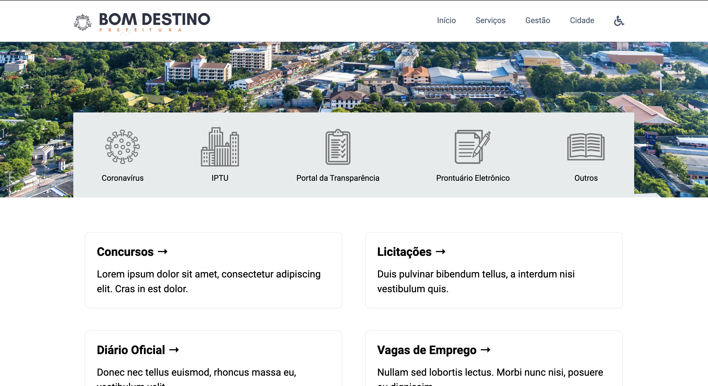

# Site Prefeitura Bom Destino

Descrição em breve...

### Build

**Com Docker**

- Subir imagem: `docker-compose up`
- Listar imagens criadas: `docker images`
- Listar containers em execução: `docker ps`
- Rebuild: `docker-compose build`
- Parar todos containers: `docker kill $(docker ps -q)`
- Remover todos containers: `docker rm $(docker ps -a -q)`
- Remover todas imagens docker: `docker rmi $(docker images -q)`

**Sem Docker**

Para executar o projeto rode `npm run dev` no terminal

### Deploy

Em breve...

### Stack

- Next.js
- ReactJs
- SASS
- Font Awesome
- Docker

### Créditos

- [Freepik](https://br.freepik.com/)
- [Prefeitura Caxias do Sul](https://caxias.rs.gov.br/)